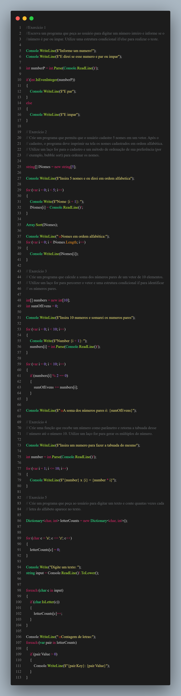

# Exercícios de Lógica de Programação

Este repositório contém uma série de exercícios de lógica de programação desenvolvidos em C#. Cada exercício foi criado para reforçar conceitos básicos de programação, como operadores, estruturas condicionais e laços de repetição.

## Estrutura do Repositório

-   **Exercício 1:** Escreva um programa que pede ao usuário para digitar um número inteiro e informa se o número é par ou ímpar utilizando uma estrutura condicional `if/else`.

-   **Exercício 2:** Crie um programa que permita ao usuário cadastrar 5 nomes em um vetor. Após o cadastro, o programa deve imprimir os nomes cadastrados em ordem alfabética.

-   **Exercício 3:** Crie um programa que calcule a soma dos números pares de um vetor de 10 elementos. Utilize um laço `for` para percorrer o vetor e uma estrutura condicional `if` para identificar os números pares.

-   **Exercício 4:** Crie uma função que recebe um número como parâmetro e retorna a tabuada desse número até o número 10. Utilize um laço `for` para gerar os múltiplos do número.

-   **Exercício 5:** Crie um programa que peça ao usuário para digitar um texto e conte quantas vezes cada letra do alfabeto aparece no texto.



## Como Executar

1. Clone o repositório:
    ```bash
    git clone https://github.com/Marqzzs/exerciciosRevisao.git
    ```
2. Abra o projeto em sua IDE de preferência (por exemplo, Visual Studio).
3. Compile e execute o projeto.
4. Siga as instruções que aparecem na tela para testar cada exercício.

## Requisitos

-   .NET SDK instalado na máquina.
-   IDE compatível com C# (Visual Studio, Visual Studio Code, etc.).
